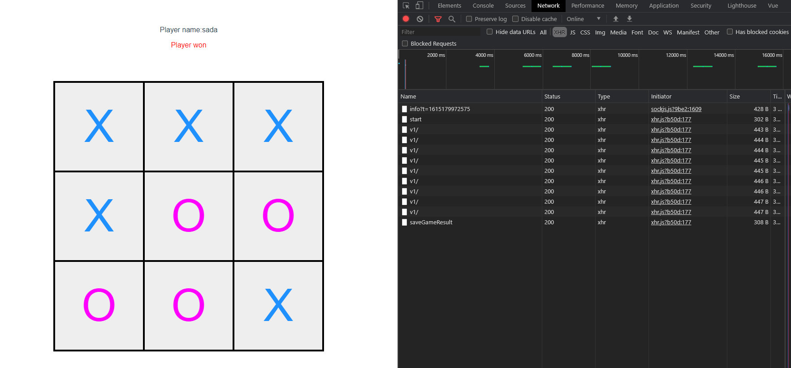

## Hello

Current state:

- Important - created on php 8.0
- Important - no support for IE - used Object entries

- Arrange .env to your username and password
- create kik database

## Download repository and:

$ cd kik_back  
 $ php bin/console doctrine:migrations:migrate  
 $ symfony serve  
 $  
$ cd kik_front  
 $ cd npm run dev

## Notes:

- able to win, loose, draw.
- js operate on random value made on array where id = undefined

## Ideas:

- create fields in foreach of foreach with array rows = [a,b,c] and values [1,2,3] to get less code lines and the same id for divs.
