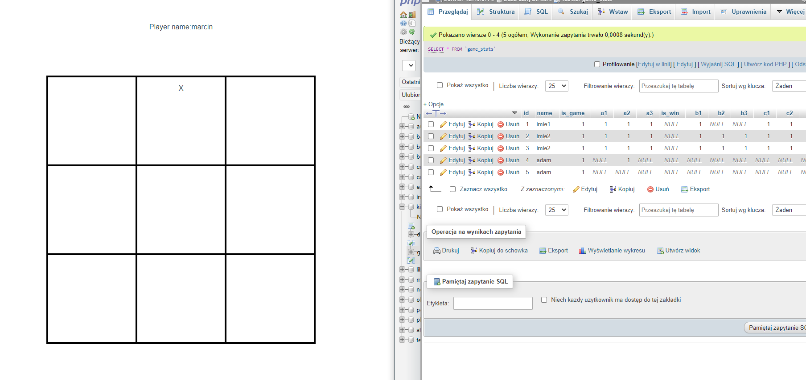

## Hello

Current state:

- Important - created on php 8.0 -
- For now - create first game in db maually.

- Arrange .env to your username and password

- Download repository and:  
  $ cd kik_back  
  $ php bin/console doctrine:migrations:migrate  
  $ symfony serve  
  $ cd ..  
  $ cd kik_front  
  $ cd npm run dev

- Notes:
  compositionAPI vue  
  symfony move handling of request to services
